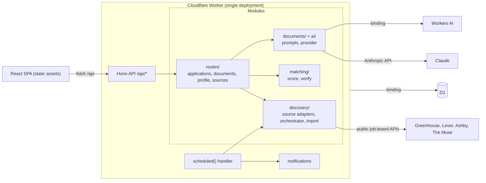
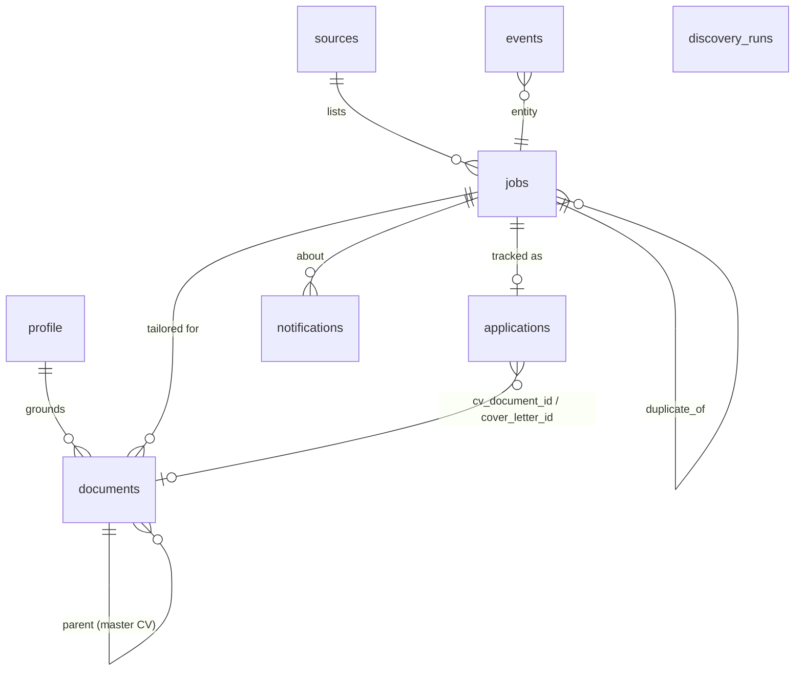

# Architecture

This document records the planning decisions behind the MVP: stack, architecture, schema,
data sources, automation feasibility, scope, Cloudflare deployment and repository layout.

## 1. Environment and stack

| Concern | Choice | Why |
| --- | --- | --- |
| Runtime | Cloudflare Workers | One deployable unit for API, cron and static assets. No servers. |
| API | [Hono](https://hono.dev) + TypeScript | Small, fast router built for Workers. |
| Frontend | React 19 + React Router 7 (SPA), plain CSS design tokens | A productivity app with no SEO needs; custom CSS keeps full control over the Apple-style design. |
| Build | Vite + `@cloudflare/vite-plugin` | Runs the Worker in `workerd` during development; one `vite build` produces both bundles. |
| Database | Cloudflare D1 (SQLite) | Relational data (jobs, applications, documents, audit log) with migrations. |
| AI | Open-weight models: GLM-5.3 / GLM-5.3-Flash on NVIDIA's free OpenAI-compatible API, gpt-oss-120b / Qwen3 on Workers AI as fallback, bge-m3 embeddings. Claude optional. | Free, open and swappable by config. See [models.md](models.md). |
| CV file parsing | Workers AI `toMarkdown` | Converts PDF/DOCX uploads without extra services. |
| Validation | zod | Request bodies and model outputs. |
| Tests | Vitest | Parsing, matching and fabrication checks are pure functions. |

## 2. Application architecture



Module boundaries follow the product workflow:

- **Discovery** (`worker/discovery`): each platform is a `SourceAdapter` with `list()`, optional
  `hydrate()` and `resolveName()`. The orchestrator filters relevant internships, dedupes, detects changes, scores and
  stores; `refresh.ts` runs 3-day refresh cycles and writes their summaries.
- **Eligibility** (`shared/eligibility.ts`, `worker/eligibility`): rules, then the fast model for ambiguous postings,
  then a pure `decide()`; gates all generation. `shared/priority.ts` ranks the shortlist.
- **Parsing** (`worker/lib/text.ts`): HTML to Markdown, workplace, deadline and duration detection, fingerprints.
- **Matching** (`worker/matching`): deterministic scoring for every job, plus verification of generated text.
- **Personalization** (`worker/personalization`): career knowledge base, job insights (requirement → evidence map, strategy, cited company research), claim validation. See [personalization.md](personalization.md).
- **Document generation** (`worker/documents`, `worker/ai`): tailored CV, cover letter, answers, quality review.
- **Application tracking** (`worker/routes/applications.ts`): pipeline state, apply kit, explicit submission confirmation.
- **Audit trail** (`events` table): every discovery, analysis, generated document and status change.

### Matching

Every job gets an explainable 0–100 score without calling a model:

| Component | Weight | Signal |
| --- | --- | --- |
| Skills | 45% | Required-skill coverage (85%) and preferred-skill coverage (15%). Skills come from the profile and the master CV, using a canonical taxonomy (`shared/skills.ts`). Requirements are split into required and preferred using the description's section headings. |
| Role | 20% | Target roles found in the title (full credit) or description (partial). |
| Location | 15% | Remote / hybrid / on-site preference and preferred locations. |
| Eligibility | 20% | Penalties for PhD-only, master's-only, clearance, citizenship, sponsorship (when needed) and graduation-year mismatches. |

Include keywords add up to 8 points; an exclude keyword caps the score at 15.
The score only ranks the inbox. Applications are built on **job insights**: what the posting evaluates, the candidate's
evidence per requirement and a tailoring strategy ([personalization.md](personalization.md)).

### CV template

Tailored CVs always use the résumé LaTeX template in [`shared/cvTemplate.ts`](../shared/cvTemplate.ts) (preamble and macros such as
`\resumeSubheadingSpaced`, `\resumeProjectHeadingSpaced`, `\resumeItem`). [`shared/cv.ts`](../shared/cv.ts) parses a master `.tex` written
with those macros into a structured document (header, entries, items, skill lines), and renders structured documents back to LaTeX,
HTML (preview and print) and plain text (matching, diffs, checks).

When the master CV is LaTeX, the model only returns *choices*: which entries to include and in what order, reworded bullets with the evidence
each uses, and the order of existing skills. Each bullet is validated against its own entry's evidence, then `applyTailoring()` applies the
choices to the master, so the header, section titles, organizations, roles, dates, locations and headings are copied verbatim, unknown entries
are ignored, skills not in the master are dropped, and bullet counts can't grow. Masters that aren't LaTeX (PDF, DOCX, Markdown) are rebuilt
into the same template structure from their text, with a warning to upload the `.tex`.

### Preventing fabrication

1. Every claim traces to an evidence id in the knowledge base (master CV, knowledge notes, profile). Prompts carry strict grounding rules.
2. Deterministic validation rejects bullet rewrites that add technologies, figures or scope their entry's evidence doesn't show, or that use another entry's evidence; the original bullet is kept.
3. Requirement matches without evidence become gaps; company facts need a cited public source.
4. A quality review (deterministic checks plus a reviewer model) runs before a draft is shown; a draft that fails is regenerated once. Exports and approval ask first when a document is unreviewed, edited since review, or needs work.
5. Drafts must be approved by the user. The untouched model output is kept in `generated_content` for auditing.

Details: [personalization.md](personalization.md).

### Duplicates

- The same posting from the same source is unique on `(source_kind, external_id)`.
- The same role on different platforms shares a `fingerprint` (normalized company, title and city). Later copies get `duplicate_of` and are hidden from Discover.
- Applications are unique per job, and tracking a job whose fingerprint is already tracked returns `409`.

### Scheduling

Cron runs hourly but only works during a **refresh cycle**, which starts once every `REFRESH_INTERVAL_HOURS` (72) based on
a stored start time rather than a day-of-month cron expression (see [data-sources.md](data-sources.md#refresh-schedule)).
During a cycle, each run checks the `DISCOVERY_SOURCES_PER_RUN` least-recently-checked sources not yet checked this cycle, classifies new and changed postings for eligibility, and fetches at most
`DISCOVERY_MAX_DETAIL_FETCHES` full descriptions (Greenhouse lists omit them). That keeps each invocation well inside Workers'
subrequest and CPU limits. Postings not fetched because of the budget are picked up on the next run. A second daily cron creates deadline reminders.

## 3. Database schema

See [`migrations/0001_init.sql`](../migrations/0001_init.sql).



| Table | Purpose |
| --- | --- |
| `profile` | Single row: contact details, education, skills, target roles, location and keyword preferences. |
| `sources` | Company boards and aggregator categories, with last run status. |
| `jobs` | Normalized postings: description (Markdown), extracted skills, deadline, fingerprint, match score and detail. |
| `job_insights` | Per job: requirements, requirement → evidence map, strategy and cited company research, with a hash of their inputs. |
| `knowledge_notes` | The candidate's additions to the knowledge base: details behind CV entries, projects, hackathons, open source, motivation. |
| `applications` | One per tracked job: status, priority, notes, chosen CV and cover letter, checklist, applied date. |
| `documents` | Master CVs (one active), tailored CVs, cover letters, answers. Draft or approved; keeps generated content and warnings. |
| `events` | Append-only audit log. |
| `notifications` | New strong matches, deadline reminders, source failures. Deduplicated by key. |
| `discovery_runs` | History of discovery runs with counts and errors. |
| `refresh_cycles` | One row per 3-day refresh cycle, with its summary (new, changed, closed, counts per eligibility status). |
| `embeddings` | Cached bge-m3 vectors for evidence and requirements. |

## 4. Data sources

See [data-sources.md](data-sources.md). In short: official public job-board APIs (Greenhouse, Lever, Ashby) for
company career pages, The Muse API for aggregated internships, and user-driven import (URL or pasted details)
for everything else. Sites without a public API that prohibit scraping (LinkedIn, Indeed, Glassdoor, Handshake) are not crawled.

## 5. Automation feasibility

See [automation.md](automation.md). Candidate-side submission APIs don't exist on the major applicant tracking systems:
Greenhouse, Lever and Ashby all require the employer's API key to submit applications. Application forms add CAPTCHAs and
custom questions. The MVP therefore uses a human-in-the-loop **Apply Kit**, and the server refuses to mark an application Applied
without explicit confirmation.

## 6. MVP scope

In scope, end to end:

Discovery → Matching → Job detail → Track → CV tailoring → Review and approve → Apply Kit → Confirm applied → Pipeline and history.

Also included because the flow depends on them: master CV upload (PDF/DOCX/Markdown), profile, cover letters and answers,
sources management, deadline tracking and reminders, in-app notifications, audit log, single-owner authentication.

Deferred: email notifications (Cloudflare Email Service needs a verified domain), multi-user accounts, DOCX export
(print-to-PDF covers the need), browser-extension autofill. Semantic matching uses embeddings cached in D1 and cosine
similarity in the Worker; Vectorize becomes worthwhile only with thousands of evidence items.

## 7. Cloudflare deployment architecture

| Service | Used for | Notes |
| --- | --- | --- |
| Workers | API, SPA assets, scheduled jobs | Static assets are served before the Worker runs; only `/api/*` invokes it. |
| D1 | All application data | Migrations in `migrations/`. |
| Workers AI | CV conversion, default LLM | Always remote, billed per use. |
| Cron Triggers | Hourly discovery, daily reminders | Defined in `wrangler.jsonc`. |
| Rate Limiting binding | Login brute-force protection | 5 attempts per minute per IP. |
| Secrets | `APP_PASSWORD`, `SESSION_SECRET`, `ANTHROPIC_API_KEY` | Set with `wrangler secret put`. |
| Observability | Logs | Structured JSON logs. |

Deliberately not used: **R2** (only text is stored; original CV files aren't retained), **Queues** (round-robin cron keeps
each run within limits without a queue), **KV** (D1 already covers the data, and sessions are stateless signed cookies),
**Durable Objects** (no real-time coordination needed). Each is a clear upgrade path if the workload grows.

Optional hardening: put the app behind **Cloudflare Access** in addition to the password.

## 8. Repository structure

```
.
├── migrations/            D1 schema and seed data
├── shared/                Types, role and skill taxonomies used by Worker and web app
├── worker/
│   ├── index.ts           Hono app, auth middleware, error handling, cron entry
│   ├── ai/                LLM provider (Claude / Workers AI) and prompts
│   ├── discovery/         Source adapters, orchestrator, URL import
│   ├── documents/         Analysis and document generation
│   ├── lib/               Auth, D1 helpers, HTTP, text parsing, validation
│   ├── matching/          Scoring and fabrication checks
│   ├── personalization/   Knowledge base, job insights, claim validation
│   ├── routes/            API routes by resource
│   └── notifications.ts   Notification helpers and deadline reminders
├── src/                   React app: components, pages, styles, API client
├── public/                Favicon and static headers (CSP)
├── test/                  Vitest unit tests
└── docs/                  This documentation
```
