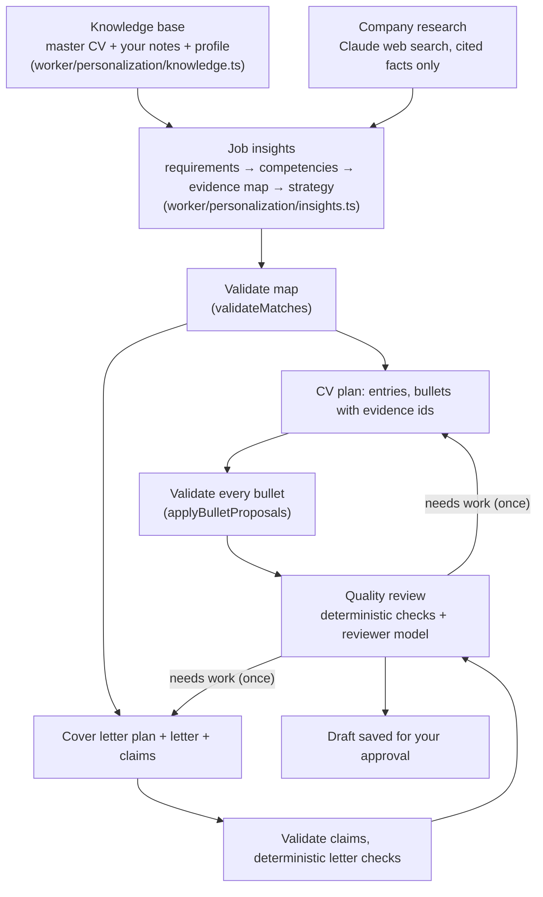

# Personalization

How tailored CVs and cover letters are built. The goal is **credible evidence of fit**: present the candidate's real
experience in the most relevant way for one role, never create a candidate who merely appears to fit.

The first version matched keywords: it extracted skills from a posting, ranked CV bullets by overlap, and asked the model
to reword bullets toward the posting's vocabulary. That produced documents that echoed job descriptions without showing
understanding of the role. The current engine works on meaning and evidence instead.

```
Understand the role → identify what the employer needs → identify the underlying competencies → retrieve the
strongest authentic evidence → select what matters most → rewrite with precision → validate every claim → review.
```

## Principles from research

Before the redesign we reviewed recruiter, hiring-manager and career-office guidance. The engine encodes the principles,
not anyone's wording.

| Principle | What it means here | Sources |
| --- | --- | --- |
| Relevance must be visible in seconds | Recruiters decide whether to read on in about 7 seconds, reading headings, titles and the start of bullets in an F-pattern. Tailoring decides which entries lead each section and which bullets lead each entry. | Ladders eye-tracking study (2018 update) |
| Accomplishments, not responsibilities | Bullets say what was built or solved, the technical context, and the result: action → technical context → problem → result. "Accomplished X, measured by Y, by doing Z" only when a real measure exists. | Laszlo Bock's XYZ formula; Gayle Laakmann McDowell; Stack Overflow hiring-manager guidance |
| Technologies in context | A tool used to build something is stronger evidence than a tool in a skills list. The evidence map treats them differently. | Stack Overflow hiring-manager guidance |
| Tailor by selection and emphasis | Lead with what proves fit, compress or drop what doesn't. Use the employer's term where it accurately names the work ("CI/CD" if you built CI/CD), never to add something you haven't done. ATS systems store and search; keyword stuffing is among the traits of the worst-performing résumés. | Ladders; recruiter guidance on ATS |
| Fluff persuades no one | Claims about teamwork or passion without evidence are ignored. | McDowell |
| A cover letter adds what the CV can't | Not a CV summary: why this role and team, how the candidate's path leads here, what they learned, what they can contribute. | Ask a Manager (Alison Green); MIT CAPD |
| Research the company, honestly | Use the posting and verifiable public facts. Never pretend to know internal teams or plans. | MIT CAPD |
| Generic AI language is a rejection trigger | Hiring managers report spotting and discounting templated phrasing ("I am thrilled to apply", "results-driven professional with a proven track record"); personal, specific detail is what they look for. | TopResume and Resume.io hiring-manager surveys (2025–2026) |

References:
[Ladders eye-tracking study](https://www.prnewswire.com/news-releases/ladders-updates-popular-recruiter-eye-tracking-study-with-new-key-insights-on-how-job-seekers-can-improve-their-resumes-300744217.html),
[How to write an effective developer resume: advice from a hiring manager](https://stackoverflow.blog/2020/11/25/how-to-write-an-effective-developer-resume-advice-from-a-hiring-manager/),
[Great resumes for software engineers (McDowell)](https://www.gayle.com/careercup-blog/2008/06/great-resumes-for-software-engineers),
[The XYZ formula](https://www.tealhq.com/post/xyz-resume),
[How to write a great cover letter (Ask a Manager)](https://www.askamanager.org/2018/05/how-to-write-a-great-cover-letter.html),
[MIT CAPD: writing a cover letter](https://capd.mit.edu/resources/career-toolkit-writing-a-cover-letter/),
[Tech Interview Handbook: résumé](https://www.techinterviewhandbook.org/resume/),
[TopResume: AI in hiring survey](https://topresume.com/career-advice/ai-in-hiring-survey).

## Pipeline



Every stage is split the same way: **the model proposes, deterministic code decides** what may be presented as the
candidate's experience ([`worker/personalization/validate.ts`](../worker/personalization/validate.ts), unit-tested in
[`test/personalization.test.ts`](../test/personalization.test.ts)).

## 1. Knowledge base

The source of truth is not the master CV alone. [`buildKnowledge()`](../worker/personalization/knowledge.ts) turns:

- **the master CV** into citable evidence: one item per entry heading (`exp1.h`), bullet (`exp1.b2`) and skill line
  (`skills.1`). Groups are numbered per section kind: `edu`, `exp`, `lead`, `proj`, `award`, `paper`.
- **knowledge notes** (the Career Knowledge page, table `knowledge_notes`) into `note12` items. A note attached to a CV
  entry (by a position-independent key such as `experiences/concorde-systems`) joins that entry's evidence group, so a
  bullet may use it. Standalone notes cover hackathons, open source, coursework and **interests and motivation**, which
  cover letters use instead of inventing enthusiasm.
- **the profile** (headline, education, listed skills) into `profile.*` items.

Notes are where the candidate adds what a one-page CV has no room for: the problem, technical decisions, scale,
collaboration, results. They are treated as the candidate's own statements.

## 2. Job insights

One model call per job ([`insightsPrompt`](../worker/ai/prompts.ts)), cached in `job_insights` and rebuilt when the
posting, master CV, notes or relevant profile fields change (an input hash).

For each requirement the model records the explicit text, its kind (**required**, **preferred**, **responsibility**,
**context**), importance (1–5), the **underlying competencies** ("scalable backend services" → API design, database design,
performance, reliability, production ownership), why the team needs it, what evidence would convince a hiring manager,
and the employer's own terms.

It then classifies the candidate's evidence per requirement, citing evidence ids:

| Class | Meaning |
| --- | --- |
| Strong Match | Directly demonstrated by experience |
| Relevant Match | Demonstrated through closely related experience |
| Transferable | The underlying competency exists in a different context |
| Weak Evidence | Some indication, insufficient proof |
| Gap | No credible evidence |
| Unknown | Not enough information to judge |

Matching is semantic: "worked with designers, backend developers and project leads to ship a platform" is evidence of
cross-functional collaboration without the phrase. Validation then enforces:

- evidence ids must exist; a strength that needs evidence but cites none becomes a **gap**;
- a strong or relevant match for a requirement naming a technology (e.g. Kubernetes) whose cited evidence never mentions
  it becomes **transferable**: related experience isn't having used the tool;
- every requirement gets a classification (missing ones are **unknown**);
- **important gaps** (gap or weak, and required or importance ≥ 3) are computed from the validated map, not the model's
  summary, so none are hidden.

The strategy records target role, top hiring signals, strongest and secondary evidence, what to de-emphasize, the CV
strategy and the cover-letter angle. It's shown on the job page (Application Strategy) and on each document.

### Company research

With Claude, a separate call uses server-side **web search and fetch** to research the product, team or domain,
engineering challenges and blog posts, recent technical developments and stated values.
[`parseResearchFacts()`](../worker/personalization/validate.ts) keeps **only statements carrying a citation** to a public
source, as facts `F1…F10`. Documents may state company facts only from the posting or these. With Workers AI there is no
research and the posting is the only source; the UI says so.

## 3. Tailored CV

The model returns a plan against the master CV ([`CvPlanSchema`](../worker/ai/prompts.ts)): entries in order, and for each
bullet its text, the master bullets it's based on (`from`), the evidence ids it uses, the requirements it addresses, and
why. Low-relevance entries go in `omit` and low-relevance bullets in `drop`, each with a reason. Master bullets the plan
neither uses nor drops stay, after the tailored ones, so strong evidence is never lost silently.

[`applyBulletProposals()`](../worker/personalization/validate.ts) checks every bullet against **its own entry's
evidence** only (heading, the bullets it rewrites, notes attached to the entry). A rewrite is rejected, and the original
bullet kept, when it:

- cites another entry's evidence, or traces to none;
- names a technology the evidence doesn't mention;
- contains a figure the evidence doesn't contain;
- claims scope ("led", "managed", "owned", "architected", "spearheaded", "mentored", "founded", "supervised") the
  evidence doesn't show; "Director of Technology" supports "led", "contributed to" does not.

Warnings flag filler and bullets much longer than the original. [`applyTailoring()`](../shared/cv.ts) then assembles the
CV in the LaTeX template: header, organizations, roles, dates and headings always come from the master; bullet counts
never grow; entries in `omit` stay out unless a section needs them to reach its minimum.

The document stores a **before/after** record for every bullet (rewritten, unchanged, rejected with the proposed text
and why, left out), the requirements each addresses, the supporting evidence, the entries left out with reasons, the
strategy and the requirement map. The **Tailoring** view shows all of it; **Diff** shows the word-level comparison.

## 4. Cover letter

Two calls: the model plans ([`LetterPlanSchema`](../worker/ai/prompts.ts)), then writes the letter from that plan
([`LetterSchema`](../worker/ai/prompts.ts)). An empty or incomplete letter is retried once and otherwise fails instead of
being saved.

- company need → why this role → why this company (research fact ids or the posting) → a two- or three-step narrative
  chain (their need → the candidate's real experience → why it matters here) → realistic contribution → motivation;
- motivation comes from the candidate's notes or what they wrote when generating the letter ("What draws you to…",
  evidence id `angle`). Otherwise the letter contains a bracketed placeholder for them to fill in;
- every factual claim is listed with the evidence ids and fact ids behind it. A claim with neither is a blocking issue.

The letter sees the tailored CV so it stays consistent without repeating it. The **Reasoning** view shows the plan.

## 5. Quality review

Before a draft is presented, [`draftWithReview()`](../worker/documents/generate.ts) runs:

1. **Deterministic checks.** CV: skills and figures not in the knowledge base or master CV (blocking), posting terms
   used four or more times when tailoring added at least two uses beyond the master CV (keyword stuffing; whole words,
   URLs ignored),
   duplicate bullets, filler. Letter: length (blocking over 450 words), generic phrases
   (blocking at three or more), company not named (blocking), unsupported skills or figures, unfilled placeholders,
   heavy word-for-word overlap with the CV.
2. **A reviewer model** scoring 1–5 on each criterion, quoting the text it judges:
   - CV: relevance, evidence strength, technical credibility, clarity, impact, ATS readability, keyword accuracy,
     consistency, no fabricated claims.
   - Letter: company specificity, role specificity, narrative, evidence, authenticity, conciseness, avoidance of generic
     AI language, consistency with the CV, clear reason for applying.

A draft is **Ready** only when nothing is blocking and no criterion scores 2 or lower. Otherwise it's regenerated once
with the review as feedback, and the better of the two drafts is kept. The review is saved with the document.

Editing a document marks its review stale. **Export gating**: downloading the `.tex`, opening Overleaf, printing,
copying or approving a CV or letter that is unreviewed, stale or needs work asks first, offering to run the review.
The user can still proceed; the decision stays theirs.

## What the engine never does

| Never | Enforced by |
| --- | --- |
| Invent experience, employers, roles or dates | Template fields always copied from the master CV; bullets must trace to their entry's evidence |
| Invent metrics | Figure check per bullet and per document |
| Invent technologies, or claim one because the posting names it | Technology check per bullet and per document; strong/relevant matches downgraded when evidence lacks the named tool |
| Upgrade "contributed to" into "led" | Scope-claim check per bullet |
| Move a fact between entries | Evidence must belong to the bullet's own entry |
| Hide gaps | Gaps computed from the validated map and shown on the job page and every document |
| Claim familiarity with a company | Company facts only from the posting or cited research |
| Manufacture motivation | Motivation only from notes or the candidate's own words; otherwise a placeholder |

## Limits

- The reviewer and the evidence map are model judgments. Deterministic checks catch invented tools, figures, scope and
  cross-entry facts; they can't prove a paraphrase is faithful. Before/after records exist so a person can.
- Technology detection uses the taxonomy in [`shared/skills.ts`](../shared/skills.ts). Tools outside it aren't checked.
- Masters that aren't LaTeX are rebuilt from text without bullet-level tracing (the document says so).
- Workers AI has a small context and output budget: requirements are capped at 10 and there's no company research.
- Cost and time: a first CV for a job makes up to five model calls (research, insights, plan, review, and a redraft and
  second review when needed); insights are reused by the cover letter and answers. Expect a few minutes with Claude.
