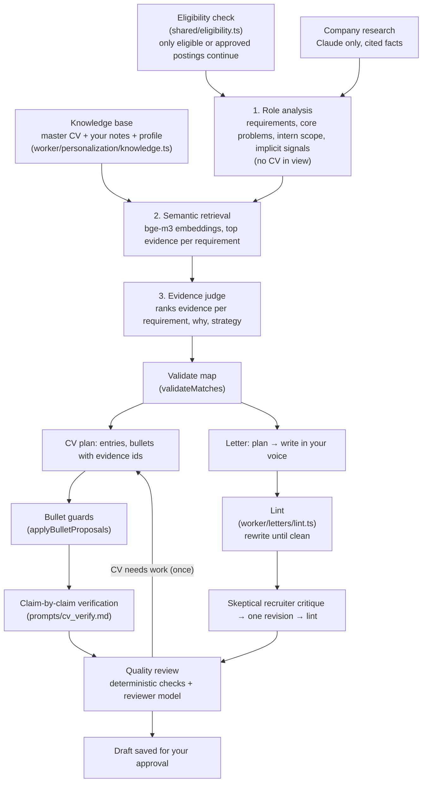

# Personalization

How tailored CVs and cover letters are built. The goal is **credible evidence of fit**: present the candidate's real
experience in the most relevant way for one role, never create a candidate who merely appears to fit.

The first version matched keywords: it extracted skills from a posting, ranked CV bullets by overlap, and asked the model
to reword bullets toward the posting's vocabulary. That produced documents that echoed job descriptions without showing
understanding of the role. The current engine works on meaning and evidence instead.

```
Understand the role → identify what the employer needs → identify the underlying competencies → retrieve the
strongest authentic evidence → select what matters most → rewrite with precision → validate every claim → review.
```

## Principles from research

Before the redesign we reviewed recruiter, hiring-manager and career-office guidance. The engine encodes the principles,
not anyone's wording.

| Principle | What it means here | Sources |
| --- | --- | --- |
| Relevance must be visible in seconds | Recruiters decide whether to read on in about 7 seconds, reading headings, titles and the start of bullets in an F-pattern. Tailoring decides which entries lead each section and which bullets lead each entry. | Ladders eye-tracking study (2018 update) |
| Accomplishments, not responsibilities | Bullets say what was built or solved, the technical context, and the result: action → technical context → problem → result. "Accomplished X, measured by Y, by doing Z" only when a real measure exists. | Laszlo Bock's XYZ formula; Gayle Laakmann McDowell; Stack Overflow hiring-manager guidance |
| Technologies in context | A tool used to build something is stronger evidence than a tool in a skills list. The evidence map treats them differently. | Stack Overflow hiring-manager guidance |
| Tailor by selection and emphasis | Lead with what proves fit, compress or drop what doesn't. Use the employer's term where it accurately names the work ("CI/CD" if you built CI/CD), never to add something you haven't done. ATS systems store and search; keyword stuffing is among the traits of the worst-performing résumés. | Ladders; recruiter guidance on ATS |
| Fluff persuades no one | Claims about teamwork or passion without evidence are ignored. | McDowell |
| A cover letter adds what the CV can't | Not a CV summary: why this role and team, how the candidate's path leads here, what they learned, what they can contribute. | Ask a Manager (Alison Green); MIT CAPD |
| Research the company, honestly | Use the posting and verifiable public facts. Never pretend to know internal teams or plans. | MIT CAPD |
| Generic AI language is a rejection trigger | Hiring managers report spotting and discounting templated phrasing ("I am thrilled to apply", "results-driven professional with a proven track record"); personal, specific detail is what they look for. | TopResume and Resume.io hiring-manager surveys (2025–2026) |

References:
[Ladders eye-tracking study](https://www.prnewswire.com/news-releases/ladders-updates-popular-recruiter-eye-tracking-study-with-new-key-insights-on-how-job-seekers-can-improve-their-resumes-300744217.html),
[How to write an effective developer resume: advice from a hiring manager](https://stackoverflow.blog/2020/11/25/how-to-write-an-effective-developer-resume-advice-from-a-hiring-manager/),
[Great resumes for software engineers (McDowell)](https://www.gayle.com/careercup-blog/2008/06/great-resumes-for-software-engineers),
[The XYZ formula](https://www.tealhq.com/post/xyz-resume),
[How to write a great cover letter (Ask a Manager)](https://www.askamanager.org/2018/05/how-to-write-a-great-cover-letter.html),
[MIT CAPD: writing a cover letter](https://capd.mit.edu/resources/career-toolkit-writing-a-cover-letter/),
[Tech Interview Handbook: résumé](https://www.techinterviewhandbook.org/resume/),
[TopResume: AI in hiring survey](https://topresume.com/career-advice/ai-in-hiring-survey).

## Pipeline



Every stage is split the same way: **the model proposes, deterministic code decides** what may be presented as the
candidate's experience ([`worker/personalization/validate.ts`](../worker/personalization/validate.ts),
[`worker/letters/lint.ts`](../worker/letters/lint.ts), unit-tested in [`test/`](../test)). Prompts live in
[`worker/prompts/`](../worker/prompts) as Markdown files you can edit; models are listed in [models.md](models.md).

## 1. Knowledge base

The source of truth is not the master CV alone. [`buildKnowledge()`](../worker/personalization/knowledge.ts) turns:

- **the master CV** into citable evidence: one item per entry heading (`exp1.h`), bullet (`exp1.b2`) and skill line
  (`skills.1`). Groups are numbered per section kind: `edu`, `exp`, `lead`, `proj`, `award`, `paper`.
- **knowledge notes** (the Career Knowledge page, table `knowledge_notes`) into `note12` items. A note attached to a CV
  entry (by a position-independent key such as `experiences/concorde-systems`) joins that entry's evidence group, so a
  bullet may use it. Standalone notes cover hackathons, open source, coursework and **interests and motivation**, which
  cover letters use instead of inventing enthusiasm.
- **the profile** (headline, education, listed skills) into `profile.*` items.

Notes are where the candidate adds what a one-page CV has no room for: the problem, technical decisions, scale,
collaboration, results. They are treated as the candidate's own statements.

## 2. Job insights

Built once per job, cached in `job_insights`, and rebuilt when the posting, master CV, notes, relevant profile fields
or company signals change (an input hash). Three steps:

1. **Role analysis** ([`prompts/role_analysis.md`](../worker/prompts/role_analysis.md)). The model reads the posting
   *without* the CV, so requirements describe the job rather than bending toward the candidate. It returns structured
   JSON: requirements (text, kind: **required** / **preferred** / **responsibility** / **context**, importance 1–5,
   underlying competencies, why it matters, what would convince, the employer's terms), the **core problems** the team
   solves, the realistic **intern scope**, and **implicit signals** (ownership, ambiguity, written communication…),
   each with the posting phrase that implies it. Signals whose phrase isn't in the posting are dropped.
2. **Semantic retrieval** ([`worker/personalization/semantic.ts`](../worker/personalization/semantic.ts)). Every
   requirement and every piece of evidence is embedded with bge-m3 (multilingual, open), cached in D1, and compared by
   cosine similarity. Each requirement gets its 8 closest pieces of evidence, at most 3 per CV entry. Skill lines
   are left out: a tool in a list isn't evidence of doing the work.
3. **Evidence judge** ([`prompts/evidence_judge.md`](../worker/prompts/evidence_judge.md)). The model ranks which
   candidates genuinely demonstrate each requirement, and why, and may reach into the full index when retrieval missed
   something. It also writes the strategy.

Company signals ([`config/companies.json`](../config/companies.json)) tell the analysis and the judge what a company
tends to weigh (Amazon: ownership, customer impact; Google: technical depth, problem solving). They steer *which*
experiences lead, never the wording: prompts forbid quoting them back.

The evidence classes:

| Class | Meaning |
| --- | --- |
| Strong Match | Directly demonstrated by experience |
| Relevant Match | Demonstrated through closely related experience |
| Transferable | The underlying competency exists in a different context |
| Weak Evidence | Some indication, insufficient proof |
| Gap | No credible evidence |
| Unknown | Not enough information to judge |

Validation then enforces:

- evidence ids must exist; a strength that needs evidence but cites none becomes a **gap**;
- a strong or relevant match for a requirement naming a technology (e.g. Kubernetes) whose cited evidence never mentions
  it becomes **transferable**: related experience isn't having used the tool;
- every requirement gets a classification (missing ones are **unknown**);
- **important gaps** (gap or weak, and required or importance ≥ 3) are computed from the validated map, not the model's
  summary, so none are hidden.

The strategy records target role, top hiring signals, strongest and secondary evidence, what to de-emphasize, the CV
strategy and the cover-letter angle. It's shown on the job page (Application Strategy) and on each document.

### Company research

With the Claude option selected, a separate call uses server-side **web search and fetch** to research the product, team or domain,
engineering challenges and blog posts, recent technical developments and stated values.
[`parseResearchFacts()`](../worker/personalization/validate.ts) keeps **only statements carrying a citation** to a public
source, as facts `F1…F10`. Documents may state company facts only from the posting or these. With the open models there's
no research and the posting is the only source; the UI says so.

## 3. Tailored CV

The model returns a plan against the master CV ([`prompts/cv_tailor.md`](../worker/prompts/cv_tailor.md)): entries in
order, and for each bullet its text, the master bullets it's based on (`from`), the evidence ids it uses, the
requirements it addresses, and why. Low-relevance entries go in `omit` and low-relevance bullets in `drop`, each with a
reason. Master bullets the plan neither uses nor drops stay, after the tailored ones, so strong evidence is never lost
silently.

Writing guidance ([`prompts/cv_principles.md`](../worker/prompts/cv_principles.md)): impact first, "accomplished X, as
measured by Y, by doing Z" only with a real measure, keep every concrete detail of the original, and never end a
bullet by saying what it demonstrates.

**Bullet guards.** [`applyBulletProposals()`](../worker/personalization/validate.ts) checks every rewrite against
**its own entry's evidence** only (heading, the bullets it rewrites, notes attached to the entry). A rewrite is
rejected, and the original bullet kept, when it:

- cites another entry's evidence, or traces to none;
- names a technology the evidence doesn't mention;
- contains a figure the evidence doesn't contain;
- claims scope ("led", "managed", "owned", "architected", "spearheaded", "mentored", "founded", "supervised") the
  evidence doesn't show; "Director of Technology" supports "led", "contributed to" does not;
- **tells the reader what it proves** (", demonstrating…", ", showcasing the ability to learn…", "expertise in");
- **drops the original's concrete details**: the technologies, numbers, acronyms and names that make it credible
  (under 60% kept, or 40% when merging bullets). This is what turned "animates BFS and DFS walks over a parsed DOM
  tree" into "a visualizer using modern technologies" in the old engine.

**Claim-by-claim verification** ([`prompts/cv_verify.md`](../worker/prompts/cv_verify.md)). Every bullet that survived
as a rewrite is split into its claims, and each is checked against that bullet's evidence: supported, partial
(overstated) or unsupported. An unsupported claim puts the master CV's bullet back; overstated ones are flagged.
The Tailoring view shows the result under **Claim Check**.

**Assembly.** [`applyTailoring()`](../shared/cv.ts) builds the CV in the LaTeX template: header, organizations, roles,
dates and headings always come from the master; bullet counts never grow; entries in `omit` stay out unless a section
needs them to reach its minimum. Then:

- **Location header.** Your real location ("Bandung, Indonesia") is added as the first header item, with "(UTC+7)"
  for remote roles. For Singapore roles, a work-authorization item appears only when **Singapore work pass (confirmed
  only)** is filled in on your profile; otherwise the CV says nothing and a warning explains what to verify.
- **One page.** The rendered length is estimated and compared with the master; a longer version gets a warning.

The document stores a **before/after** record for every bullet (rewritten, unchanged, rejected with the proposed text
and why, left out), the requirements each addresses, the supporting evidence, the claim check, the entries left out
with reasons, the strategy and the requirement map. **Diff** shows the word-level comparison.

## 4. Cover letter

The highest-risk document for sounding machine-written, so it gets the most machinery:

1. **Plan** ([`prompts/letter_plan.md`](../worker/prompts/letter_plan.md)): the team's concrete need, a specific
   opening, a two- or three-step narrative (their need → your real experience with the detail that makes it credible
   → why it matters here), a realistic contribution, motivation from your notes (or a placeholder), and the one
   location sentence.
2. **Write** ([`prompts/letter_write.md`](../worker/prompts/letter_write.md)) in your voice: files in
   [`voice_samples/`](../voice_samples/README.md) (git-ignored) are shown as a style reference for rhythm and word
   choice, never as evidence.
3. **Lint** ([`worker/letters/lint.ts`](../worker/letters/lint.ts)). A program rejects the letter, and it's rewritten
   with the violations as feedback, if it:
   - is outside 200–280 words (body only; [`config/letter.json`](../config/letter.json), which also sets the number
     of rewrites, 2 by default);
   - uses an em or en dash, a semicolon, a colon in a sentence, or an exclamation mark;
   - uses any phrase in [`config/banned_phrases.txt`](../config/banned_phrases.txt) (plain phrases or `re:` regexes:
     "excited to apply", "leverage", "delve", "tapestry", "not only… but also", "it's not just X, it's Y"…);
   - lists three single words in a row ("fast, reliable, and scalable");
   - opens by announcing the application or the candidate;
   - doesn't name the company;
   - spends more than one sentence on location, or mentions a work pass, visa or authorization that isn't confirmed
     on your profile;
   - has a paragraph without a concrete detail from your experience **and** one about this company or role;
   - makes a claim your evidence or the posting doesn't support. A fast model fact-checks every draft
     ([`prompts/letter_verify.md`](../worker/prompts/letter_verify.md)) and each finding must quote the letter. The
     2026-09-30 evaluation caught gpt-oss inventing "validation against a labeled test set" and "a report that informed
     the team's decision", which the mechanical rules alone let through.

   Unicode hyphens (U+2010–2012) are normalized first, so "production‑grade" can't slip past the banned list.
4. **Skeptical recruiter** ([`prompts/letter_critique.md`](../worker/prompts/letter_critique.md)): a persona who has
   read ten thousand letters flags machine-written tells, generic lines, flattery, unsupported claims and anything said
   about the company that the posting doesn't state, quoting each, with a fix. The letter is **revised once** from the critique
   ([`prompts/letter_revise.md`](../worker/prompts/letter_revise.md)) and linted again; the revision is kept unless it
   breaks more rules than the draft. The Reasoning view shows the critique and the draft before revision.
5. **Grounding**: every factual claim is listed with the evidence ids and fact ids behind it (a claim with neither is
   blocking). There's no extra reviewer call (fast mode): the verdict comes from the rules, the grounding checks and
   the recruiter pass. **Review Again** on the document runs the full scored review when you want it.

Prompts after the role analysis are slimmed: the CV plan gets the role analysis instead of the raw posting, the letter
gets only the CV entries relevant to this role (from the evidence map and retrieval) and a trimmed posting, and the
evidence judge gets a one-line-per-entry index instead of the whole knowledge base. That cuts tokens, time and quota.

**Location, honestly.** Remote roles: one plain sentence about working from Bandung (UTC+7) and covering the stated
overlap, only when the posting stresses remote work. Singapore roles: at most one sentence about being available for
on-site or hybrid work, and a work-authorization statement only when it's confirmed on your profile. Never the
centerpiece.

## 5. Quality review

Before a draft is presented, [`draftWithReview()`](../worker/documents/generate.ts) runs:

1. **Deterministic checks.** CV: skills and figures not in the knowledge base or master CV (blocking), posting terms
   used four or more times when tailoring added at least two uses beyond the master CV (keyword stuffing; whole words,
   URLs ignored),
   duplicate bullets, filler. Letter: length (blocking over 450 words), generic phrases
   (blocking at three or more), company not named (blocking), unsupported skills or figures, unfilled placeholders,
   heavy word-for-word overlap with the CV.
2. **A reviewer model** scoring 1–5 on each criterion, quoting the text it judges. It's told that most drafts aren't a
   5 and must quote the weakest bullet or sentence before scoring (the old reviewer gave a keyword-stuffed CV 5/5
   across the board):
   - CV: relevance, evidence strength, technical credibility, clarity, impact, ATS readability, keyword accuracy,
     consistency, no fabricated claims.
   - Letter: company specificity, role specificity, narrative, evidence, authenticity, conciseness, avoidance of generic
     AI language, consistency with the CV, clear reason for applying.

A draft is **Ready** only when nothing is blocking and no criterion scores 2 or lower. A CV that isn't ready is
regenerated once with the review as feedback, and the better of the two is kept; letters already went through the
lint and critique loop, so the review only scores them. The review is saved with the document.

Editing a document marks its review stale. **Export gating**: downloading the `.tex`, opening Overleaf, printing,
copying or approving a CV or letter that is unreviewed, stale or needs work asks first, offering to run the review.
The user can still proceed; the decision stays theirs.

## What the engine never does

| Never | Enforced by |
| --- | --- |
| Invent experience, employers, roles or dates | Template fields always copied from the master CV; bullets must trace to their entry's evidence |
| Invent metrics | Figure check per bullet and per document |
| Invent technologies, or claim one because the posting names it | Technology check per bullet and per document; strong/relevant matches downgraded when evidence lacks the named tool |
| Upgrade "contributed to" into "led" | Scope-claim check per bullet |
| Move a fact between entries | Evidence must belong to the bullet's own entry |
| Hide gaps | Gaps computed from the validated map and shown on the job page and every document |
| Claim familiarity with a company | Company facts only from the posting or cited research |
| Manufacture motivation | Motivation only from notes or the candidate's own words; otherwise a placeholder |
| Imply a work pass you don't hold | Header and letter mention one only when confirmed on the profile; the lint rejects any unconfirmed mention |
| Tailor for a job you can't take | Generation refuses postings that aren't eligible or approved (`409`) |

## Limits

- The reviewer and the evidence map are model judgments. Deterministic checks catch invented tools, figures, scope and
  cross-entry facts; they can't prove a paraphrase is faithful. Before/after records exist so a person can.
- Technology detection uses the taxonomy in [`shared/skills.ts`](../shared/skills.ts). Tools outside it aren't checked.
- Masters that aren't LaTeX are rebuilt from text without bullet-level tracing (the document says so).
- Without `LLM_API_KEY`, the Workers AI fallback caps requirements at 10, compacts prompts, and is slow (1–2 minutes
  per large call). There's no company research without Claude.
- Cost and time: a first CV makes about six model calls (role analysis, judge, plan, verification, review, sometimes a
  redraft and second review) plus one embedding batch; insights are reused by the cover letter and answers. A letter
  makes four to eight (plan, one to three writes, critique, one or two revisions, review). All free on NVIDIA's API
  within its rate limit.
- The lint's specificity rule matches words, so a paragraph can pass it while still being bland; the recruiter pass
  and your own read are the backstop.
